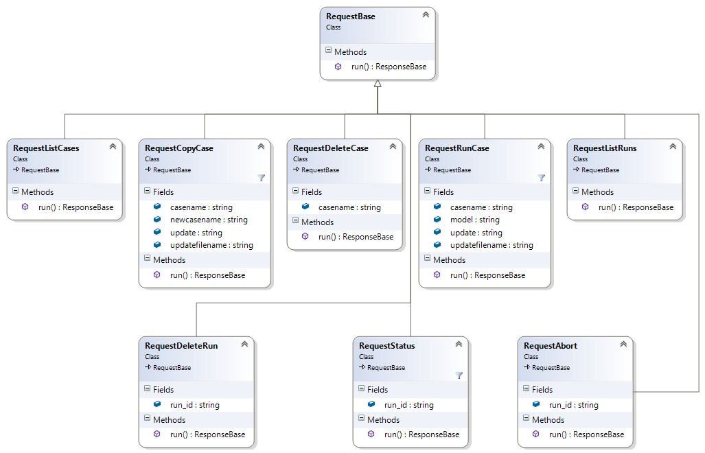

# Main components
* `PSRRunAPI.dll`: API provided as a .NET dynamic library
* `PSRHttpApi.exe`: API provided as a standalone HTTP server
* `PSRHttpAPIService.exe`: API provided as a windows service
* `MasterConverter`: Console application that provides the functionalities associated to data modification
* `Data Dictionary`: document that describes the attributes of each element represented in SDDP/NCP models
  * Identify the attributes that you are intended to modify, read the description, check the unit, the data type,
check whether is just a parameter or something more complex as a timeseries

# HTTP server layer

All communication with the server can be done using GET requests (passing the parameter directly) or POST requests (passing the parameters via JSON file)

* `/listcases`: List all available base cases
* `/copycase`: Copy a specific base case applying data modifications
* `/delcase`: Delete a specific base case
* `/run`: Run a specific base case applying data modifications
* `/status`: Check the status of a given run
* `/abort`: Immediately stop a given run
* `/listruns`: List all runs (running, finished or failed)
* `/getresults`: Get all the output files and model results of a given run
* `/delrun`: Delete a specific run

# API class diagram

